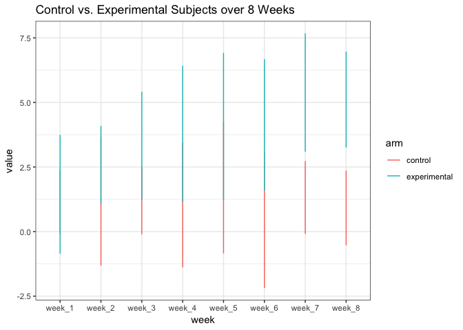

Homework 5
================
Jeanette Shekelle
11/5/2018

### Problem 1

Bringing in data from desktop folder data\_problem\_1:

``` r
list_path = list.files(path = "./data_problem_1", full.names = TRUE) 
remove_path = basename(list_path)
  
files_function = 
  function(data, name){
  list(read_csv(data) %>% 
  mutate(id = name))
}
path_names = 
  map2(list_path, remove_path, files_function)
```

    ## Parsed with column specification:
    ## cols(
    ##   week_1 = col_double(),
    ##   week_2 = col_double(),
    ##   week_3 = col_double(),
    ##   week_4 = col_double(),
    ##   week_5 = col_double(),
    ##   week_6 = col_double(),
    ##   week_7 = col_double(),
    ##   week_8 = col_double()
    ## )
    ## Parsed with column specification:
    ## cols(
    ##   week_1 = col_double(),
    ##   week_2 = col_double(),
    ##   week_3 = col_double(),
    ##   week_4 = col_double(),
    ##   week_5 = col_double(),
    ##   week_6 = col_double(),
    ##   week_7 = col_double(),
    ##   week_8 = col_double()
    ## )
    ## Parsed with column specification:
    ## cols(
    ##   week_1 = col_double(),
    ##   week_2 = col_double(),
    ##   week_3 = col_double(),
    ##   week_4 = col_double(),
    ##   week_5 = col_double(),
    ##   week_6 = col_double(),
    ##   week_7 = col_double(),
    ##   week_8 = col_double()
    ## )
    ## Parsed with column specification:
    ## cols(
    ##   week_1 = col_double(),
    ##   week_2 = col_double(),
    ##   week_3 = col_double(),
    ##   week_4 = col_double(),
    ##   week_5 = col_double(),
    ##   week_6 = col_double(),
    ##   week_7 = col_double(),
    ##   week_8 = col_double()
    ## )
    ## Parsed with column specification:
    ## cols(
    ##   week_1 = col_double(),
    ##   week_2 = col_double(),
    ##   week_3 = col_double(),
    ##   week_4 = col_double(),
    ##   week_5 = col_double(),
    ##   week_6 = col_double(),
    ##   week_7 = col_double(),
    ##   week_8 = col_double()
    ## )
    ## Parsed with column specification:
    ## cols(
    ##   week_1 = col_double(),
    ##   week_2 = col_double(),
    ##   week_3 = col_double(),
    ##   week_4 = col_double(),
    ##   week_5 = col_double(),
    ##   week_6 = col_double(),
    ##   week_7 = col_double(),
    ##   week_8 = col_double()
    ## )
    ## Parsed with column specification:
    ## cols(
    ##   week_1 = col_double(),
    ##   week_2 = col_double(),
    ##   week_3 = col_double(),
    ##   week_4 = col_double(),
    ##   week_5 = col_double(),
    ##   week_6 = col_double(),
    ##   week_7 = col_double(),
    ##   week_8 = col_double()
    ## )
    ## Parsed with column specification:
    ## cols(
    ##   week_1 = col_double(),
    ##   week_2 = col_double(),
    ##   week_3 = col_double(),
    ##   week_4 = col_double(),
    ##   week_5 = col_double(),
    ##   week_6 = col_double(),
    ##   week_7 = col_double(),
    ##   week_8 = col_double()
    ## )
    ## Parsed with column specification:
    ## cols(
    ##   week_1 = col_double(),
    ##   week_2 = col_double(),
    ##   week_3 = col_double(),
    ##   week_4 = col_double(),
    ##   week_5 = col_double(),
    ##   week_6 = col_double(),
    ##   week_7 = col_double(),
    ##   week_8 = col_double()
    ## )
    ## Parsed with column specification:
    ## cols(
    ##   week_1 = col_double(),
    ##   week_2 = col_double(),
    ##   week_3 = col_double(),
    ##   week_4 = col_double(),
    ##   week_5 = col_double(),
    ##   week_6 = col_double(),
    ##   week_7 = col_double(),
    ##   week_8 = col_double()
    ## )
    ## Parsed with column specification:
    ## cols(
    ##   week_1 = col_double(),
    ##   week_2 = col_double(),
    ##   week_3 = col_double(),
    ##   week_4 = col_double(),
    ##   week_5 = col_double(),
    ##   week_6 = col_double(),
    ##   week_7 = col_double(),
    ##   week_8 = col_double()
    ## )
    ## Parsed with column specification:
    ## cols(
    ##   week_1 = col_double(),
    ##   week_2 = col_double(),
    ##   week_3 = col_double(),
    ##   week_4 = col_double(),
    ##   week_5 = col_double(),
    ##   week_6 = col_double(),
    ##   week_7 = col_double(),
    ##   week_8 = col_double()
    ## )
    ## Parsed with column specification:
    ## cols(
    ##   week_1 = col_double(),
    ##   week_2 = col_double(),
    ##   week_3 = col_double(),
    ##   week_4 = col_double(),
    ##   week_5 = col_double(),
    ##   week_6 = col_double(),
    ##   week_7 = col_double(),
    ##   week_8 = col_double()
    ## )

    ## Parsed with column specification:
    ## cols(
    ##   week_1 = col_double(),
    ##   week_2 = col_double(),
    ##   week_3 = col_double(),
    ##   week_4 = col_double(),
    ##   week_5 = col_double(),
    ##   week_6 = col_double(),
    ##   week_7 = col_integer(),
    ##   week_8 = col_double()
    ## )

    ## Parsed with column specification:
    ## cols(
    ##   week_1 = col_double(),
    ##   week_2 = col_double(),
    ##   week_3 = col_double(),
    ##   week_4 = col_double(),
    ##   week_5 = col_double(),
    ##   week_6 = col_double(),
    ##   week_7 = col_double(),
    ##   week_8 = col_double()
    ## )
    ## Parsed with column specification:
    ## cols(
    ##   week_1 = col_double(),
    ##   week_2 = col_double(),
    ##   week_3 = col_double(),
    ##   week_4 = col_double(),
    ##   week_5 = col_double(),
    ##   week_6 = col_double(),
    ##   week_7 = col_double(),
    ##   week_8 = col_double()
    ## )
    ## Parsed with column specification:
    ## cols(
    ##   week_1 = col_double(),
    ##   week_2 = col_double(),
    ##   week_3 = col_double(),
    ##   week_4 = col_double(),
    ##   week_5 = col_double(),
    ##   week_6 = col_double(),
    ##   week_7 = col_double(),
    ##   week_8 = col_double()
    ## )
    ## Parsed with column specification:
    ## cols(
    ##   week_1 = col_double(),
    ##   week_2 = col_double(),
    ##   week_3 = col_double(),
    ##   week_4 = col_double(),
    ##   week_5 = col_double(),
    ##   week_6 = col_double(),
    ##   week_7 = col_double(),
    ##   week_8 = col_double()
    ## )
    ## Parsed with column specification:
    ## cols(
    ##   week_1 = col_double(),
    ##   week_2 = col_double(),
    ##   week_3 = col_double(),
    ##   week_4 = col_double(),
    ##   week_5 = col_double(),
    ##   week_6 = col_double(),
    ##   week_7 = col_double(),
    ##   week_8 = col_double()
    ## )
    ## Parsed with column specification:
    ## cols(
    ##   week_1 = col_double(),
    ##   week_2 = col_double(),
    ##   week_3 = col_double(),
    ##   week_4 = col_double(),
    ##   week_5 = col_double(),
    ##   week_6 = col_double(),
    ##   week_7 = col_double(),
    ##   week_8 = col_double()
    ## )

``` r
problem_1_df = 
  map_df(path_names, bind_rows)
```

Tidy the result; manipulate file names to include control arm and subject ID \* Make columns variables and rows observations

``` r
problem_1_df_clean = 
problem_1_df %>% 
  gather(key = "week", value = "value", week_1:week_8) %>% 
  separate(id, into = c("arm","id"), sep = "_") %>% 
  mutate(id = str_replace(id, ".csv", ""),
         arm = str_replace(arm, "con", "control"), 
         arm = str_replace(arm, "exp", "experimental")) 
```

Make a spaghetti plot showing observations on each subject over time, and comment on differences between groups.

``` r
problem_1_df_clean %>% 
  group_by(id) %>% 
  ggplot(aes(x = week, y = value, color = arm)) +
  geom_line() + 
  theme_bw() + 
  labs (title = "Control vs. Experimental Subjects over 8 Weeks")
```



I know this is not a spaghetti plot but it still shows differences between groups. We see that the experimental group had higher values than the control group in all weeks except week 1. The gap between experimental and control grew larger as the weeks went on. By week 7 and 8 there was a noticable gap.

### Problem 2

``` r
homicide_data = read_csv(file = "./data_problem_2/homicide_data.csv")
```

    ## Parsed with column specification:
    ## cols(
    ##   uid = col_character(),
    ##   reported_date = col_integer(),
    ##   victim_last = col_character(),
    ##   victim_first = col_character(),
    ##   victim_race = col_character(),
    ##   victim_age = col_character(),
    ##   victim_sex = col_character(),
    ##   city = col_character(),
    ##   state = col_character(),
    ##   lat = col_double(),
    ##   lon = col_double(),
    ##   disposition = col_character()
    ## )

The raw data contains 52,179 observations and 12 variables. Each observation is a homicide. Important variables are the city and state where it occured and the disposition (arrest made, case still open, closed without arrest, etc.). The dataset also contains the victims first and last name, sex, age, and the exact location of the homicide (longitude and latitude).

Looking at total homicides by city and state:

``` r
  homicide_data %>% 
  mutate(city_state = paste(city, state, sep = ',')) %>% 
  group_by(city_state) %>% 
  summarise(total_homicides = n()) %>% 
  knitr::kable()
```

| city\_state       |  total\_homicides|
|:------------------|-----------------:|
| Albuquerque,NM    |               378|
| Atlanta,GA        |               973|
| Baltimore,MD      |              2827|
| Baton Rouge,LA    |               424|
| Birmingham,AL     |               800|
| Boston,MA         |               614|
| Buffalo,NY        |               521|
| Charlotte,NC      |               687|
| Chicago,IL        |              5535|
| Cincinnati,OH     |               694|
| Columbus,OH       |              1084|
| Dallas,TX         |              1567|
| Denver,CO         |               312|
| Detroit,MI        |              2519|
| Durham,NC         |               276|
| Fort Worth,TX     |               549|
| Fresno,CA         |               487|
| Houston,TX        |              2942|
| Indianapolis,IN   |              1322|
| Jacksonville,FL   |              1168|
| Kansas City,MO    |              1190|
| Las Vegas,NV      |              1381|
| Long Beach,CA     |               378|
| Los Angeles,CA    |              2257|
| Louisville,KY     |               576|
| Memphis,TN        |              1514|
| Miami,FL          |               744|
| Milwaukee,wI      |              1115|
| Minneapolis,MN    |               366|
| Nashville,TN      |               767|
| New Orleans,LA    |              1434|
| New York,NY       |               627|
| Oakland,CA        |               947|
| Oklahoma City,OK  |               672|
| Omaha,NE          |               409|
| Philadelphia,PA   |              3037|
| Phoenix,AZ        |               914|
| Pittsburgh,PA     |               631|
| Richmond,VA       |               429|
| Sacramento,CA     |               376|
| San Antonio,TX    |               833|
| San Bernardino,CA |               275|
| San Diego,CA      |               461|
| San Francisco,CA  |               663|
| Savannah,GA       |               246|
| St. Louis,MO      |              1677|
| Stockton,CA       |               444|
| Tampa,FL          |               208|
| Tulsa,AL          |                 1|
| Tulsa,OK          |               583|
| Washington,DC     |              1345|

Looking at total unsolved homicides:

``` r
homicide_data %>% 
  filter(str_detect(disposition, "open | without")) %>% 
  mutate(city_state = paste(city, state, sep = ',')) %>% 
  group_by(city_state) %>% 
  summarise(total_unsolved = n()) %>% 
  knitr::kable()
```

| city\_state       |  total\_unsolved|
|:------------------|----------------:|
| Albuquerque,NM    |               52|
| Atlanta,GA        |               58|
| Baltimore,MD      |              152|
| Baton Rouge,LA    |               16|
| Birmingham,AL     |               64|
| Buffalo,NY        |                8|
| Charlotte,NC      |               44|
| Chicago,IL        |              387|
| Cincinnati,OH     |               49|
| Columbus,OH       |               80|
| Dallas,TX         |               78|
| Denver,CO         |               46|
| Detroit,MI        |               16|
| Durham,NC         |               11|
| Fort Worth,TX     |               35|
| Fresno,CA         |               23|
| Houston,TX        |              346|
| Indianapolis,IN   |              102|
| Jacksonville,FL   |              141|
| Kansas City,MO    |               36|
| Las Vegas,NV      |              175|
| Long Beach,CA     |               27|
| Memphis,TN        |               50|
| Miami,FL          |               63|
| Milwaukee,wI      |               37|
| Minneapolis,MN    |               31|
| Nashville,TN      |               57|
| New Orleans,LA    |               98|
| New York,NY       |               17|
| Oklahoma City,OK  |               11|
| Omaha,NE          |               10|
| Philadelphia,PA   |               92|
| Phoenix,AZ        |               96|
| Richmond,VA       |               20|
| Sacramento,CA     |               23|
| San Antonio,TX    |               87|
| San Bernardino,CA |               19|
| San Diego,CA      |               64|
| San Francisco,CA  |                1|
| Savannah,GA       |               12|
| St. Louis,MO      |               40|
| Stockton,CA       |               11|
| Tampa,FL          |                8|
| Tulsa,OK          |               55|
| Washington,DC     |               74|

Proportion of unsolved homicides in Baltimore

``` r
baltimore_unsolved = 
  homicide_data %>% 
  filter(city == "Baltimore") %>% 
  filter(str_detect(disposition, "open | without")) %>% 
  summarise(total_unsolved = n())
```

``` r
baltimore_total = 
  homicide_data %>% 
  filter(city == "Baltimore") %>% 
  summarise(total_homicides = n())
```
